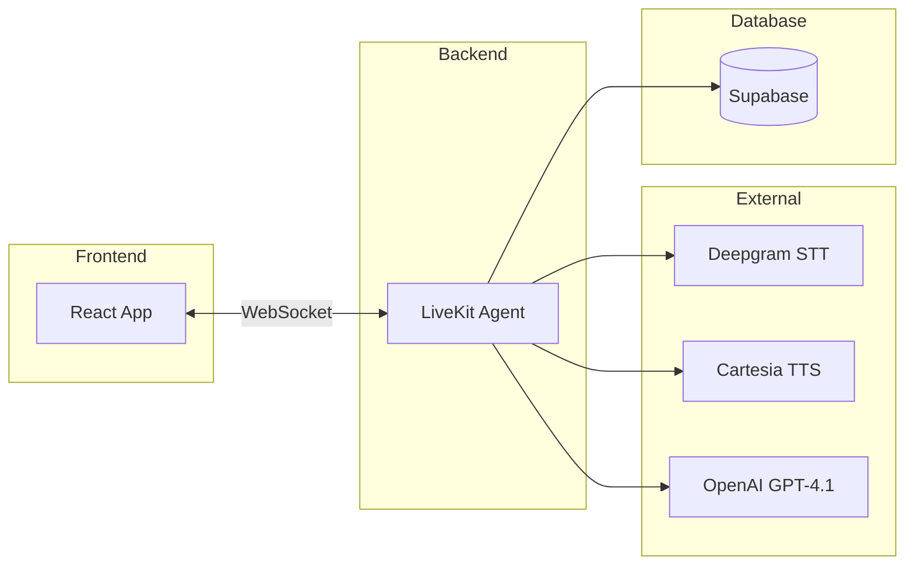
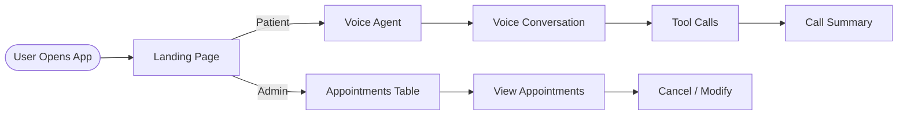

# Architecture Overview

## System Overview

## User Flow

## How It Works

- **User speaks** into microphone
- **Deepgram STT** converts speech to text
- **OpenAI GPT-4.1** processes the text and decides what tool to call
- **Tools** interact with Supabase database (book, cancel, modify appointments)
- **Cartesia TTS** converts response text back to speech
- **User hears** the agent's response

## Components

- **LiveKit Cloud** - Handles real-time voice communication
- **Deepgram Flux** - Speech-to-text conversion
- **OpenAI GPT-4.1-mini** - Language model for conversation and tool calling
- **Cartesia Sonic** - Text-to-speech for natural voice output
- **Supabase** - PostgreSQL database for users, slots, and appointments

## Data Flow

1. User joins LiveKit room
2. Agent greets user and asks for phone number
3. User provides phone → `identify_user` tool called
4. User requests action (book/cancel/modify)
5. Agent calls appropriate tool
6. Database updated
7. Agent confirms action to user
8. Conversation ends → summary saved
